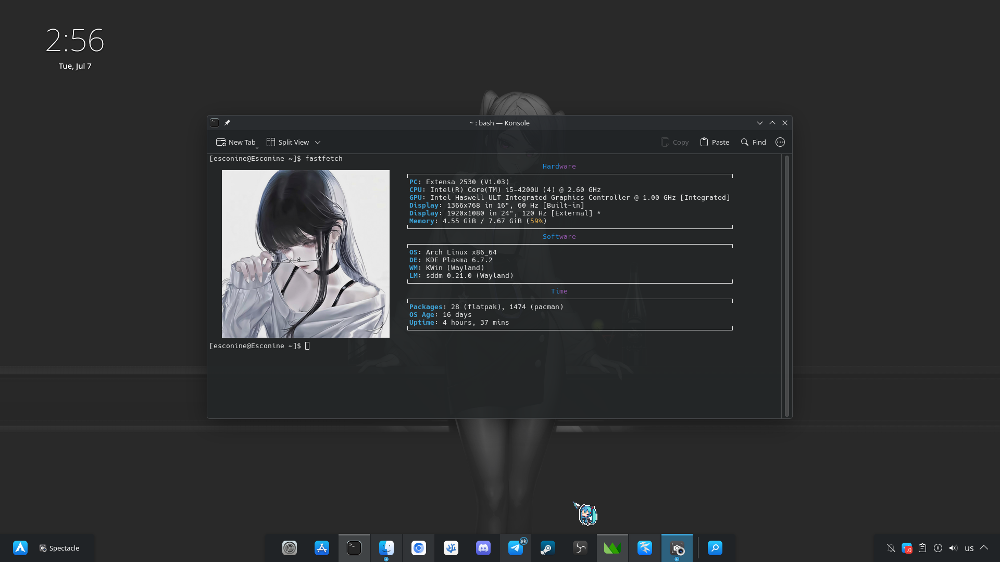

# Minimalistic Fastfetch Config
My custom and minimalistic fastfetch configuration. I hope you will like it ❤️

<div align="center">


</div>

## Installation Guide

To install the fastfetch config just run in terminal:

> [!WARNING]
> This command will permanently delete your "~/.config/fastfetch" directory. Please make sure you have a backup of it's data before running it

```
sudo pacman -S ttf-jetbrains-mono-nerd
git clone https://github.com/Esconine/Fastfetch-Config.git
rm -rf ~/.config/fastfetch && cp -r ~/Fastfetch-Config/fastfetch ~/.config/fastfetch && rm -rf ~/Fastfetch-Config
```

## Logo

> [!NOTE]
> If you want to use your own Fastfetch logo follow these steps:
>
> 1. Delete the existing logo at "~/.config/fastfetch/logo/fastfetch.png" by running this command in the terminal:
> 
> ```
> rm -rf ~/.config/fastfetch/logo/fastfetch.png
> ```
>
> 2. Move your image into the "~/.config/fastfetch/logo" directory and rename it to "fastfetch.png"


